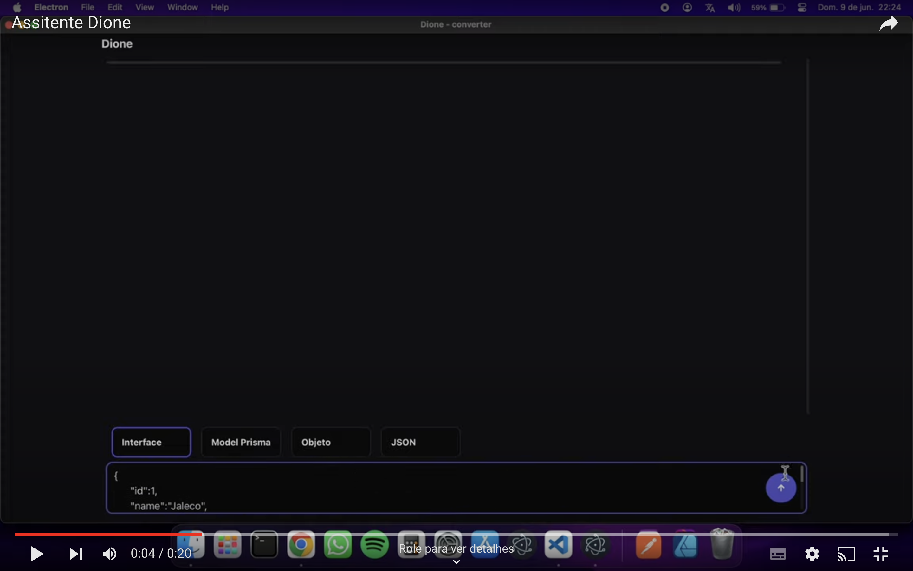

# Dione IA

## Conversor para typescript, JSON, Objeto e Model Prisma com IA

Dione é uma aplicação assistente que utiliza inteligência artificial (Meta Lhama) para converter objetos JavaScript, interfaces TypeScript, JSON e modelos do Prisma.

Demonstração:
[](https://youtu.be/6PGI6iuZUbA 'Assistir ao video')

### Mode de usar

- Primeiramente, crie uma API Key no site do [Groq](https://console.groq.com/keys)

- Adicione sua API Key em um arquivo .env na raiz do projeto.

- Instale as dependências do React:

```bash
npm install
```

- Você pode rodar o projeto no navegador com:

```bash
npm run dev
```

- Ou pode rodar como uma aplicação usando o Electron:

```bash
npm run start
```

### Creditos

Principais frameworks e bibliotecas utilizados:

- [React-JS](https://pt-br.react.dev/blog/2023/03/16/introducing-react-dev)
- [Electron-JS](https://www.electronjs.org)
- [TypeScript](https://www.typescriptlang.org)
- [Radix UI](https://www.radix-ui.com/)
- [Vite](https://vitejs-dev.translate.goog/?_x_tr_sl=en&_x_tr_tl=pt&_x_tr_hl=pt-BR&_x_tr_pto=sc)
- [Meta Lhama](https://llama.meta.com/docs/get-started/)

---

### Sociais

GitHub [@kaique-oliveira](https://github.com/kaique-oliveira) &nbsp;&middot;&nbsp;
Linkedin [@kaique-oliveira](https://www.linkedin.com/in/kaique-oliveira-a21273162/)
